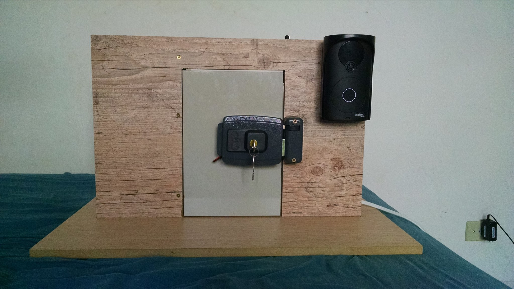
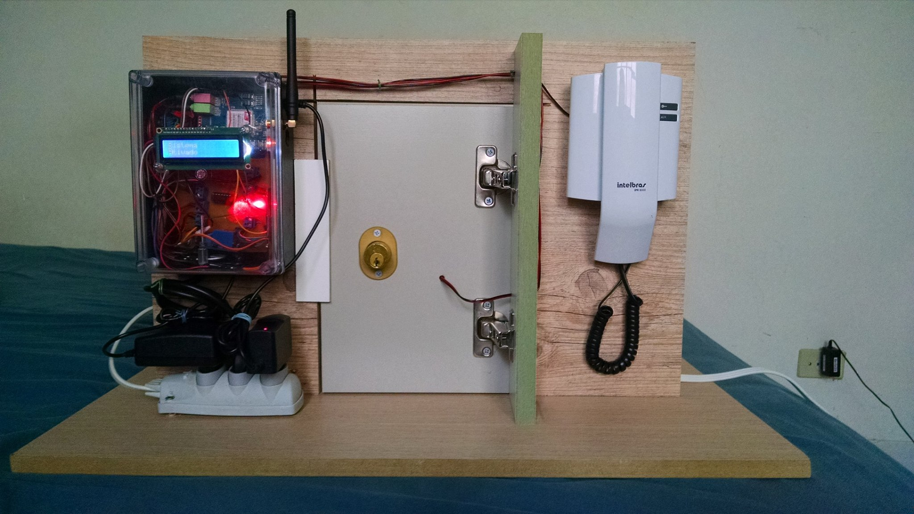

# Projeto Eng. de Computação

# Objetivo:
Projeto utilizado para conclusão do curso de Eng. de Computação 2011 - 2015

# Estrutura do projeto
```
├── docs
│    └── Monografia_Alcir_Junior_2401298873.pdf
├── src
│    ├── main
│    │	  └── app.ino
│    └── test
│   	  ├── displayi2c_v1
│   	  ├── fazerligacao_v1
│   	  ├── fazerligacao_v2
│   	  ├── fazerligacaorecebersmsemostrarnodisplay_v1
│   	  ├── fazerligacaorecebersmsmostrarnodisplayecampainha_v1
│   	  ├── limparsms
│   	  ├── receberligacao_v1
│   	  ├── recebersmsemostrarnodisplay_v1
│   	  └── recebersmsemostrarnodisplay_v2
```

# Fotos


